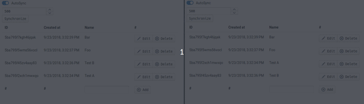

# APIBase

[](https://travis-ci.com/chapterjason/APIBase)

## Getting started

Run the following commands to rebuild and run the example.

1. Cleanup everything
    ```
    lerna run clean
    ```
2. Update all dependencies
    ```
    lerna bootstrap
    ```
3. Build
    ```
    lerna run build
    ```
4. Start server
    
    To start the server change the directory to `packages/example-server`.
    ```
    yarn run start
    ```
    If you are using `npm` run
    ```
    npm run-script start
    ```

After you have done all these commands open the `index.html` under `packages/example-client`



## API
- [Core API](packages/core/docs/README.md)
- [Database API](packages/database/docs/README.md)
